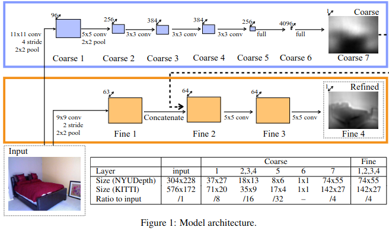
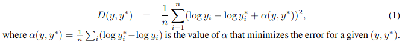

# Title: Depth Map Prediction from a Single Image using a Multi-Scale Deep Network
## Author: David Eigen (2014)
## Article: [arxiv](https://arxiv.org/pdf/1406.2283.pdf)
## Task: Depth Estimation 
___

### General content
Depth prediction using two deep networks stacks: one makes a coarse global prediction on entire image, another refines this prediction locally. Also a scale-invariant error was used to measure depth relation rather than scale.

### Keypoints
* Coarse-scale network
* Fine-scale network
* Scale-invariant error

### Model architecture
  
### Scale-invariant loss

### Notes

* The final output is at 1/4-resolution compared to the input.
* All hidden layers of the coarse-scale network use ReLU, except layer 7, which is linear. Dropout applied to layer 6. The convolu-
tional layers (1-5) of the coarse-scale network are pretrained on the ImageNet classification task.
* All hidden units of the fine-scale network use rectified linear activations. The last convolutional layer is linear, as it predicts the target depth. Firstly the coarse network is trained against the ground-truth targets, then fine-scale network is trained keeping the coarse-scale output fixed (i.e. when training the fine network, we do not backpropagate through the coarse one).
* Scale-invariant error intuition: difference of predicted and ground-truth depths minus mean difference of predicted and ground-truth depths (which represents the scale of the prediction).

### Results
* SOTA results at the time.
* In future want to use surface normals and other 3D geometry information.