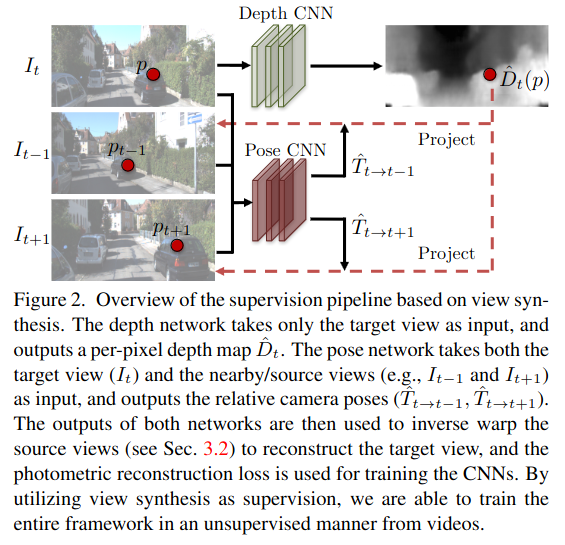
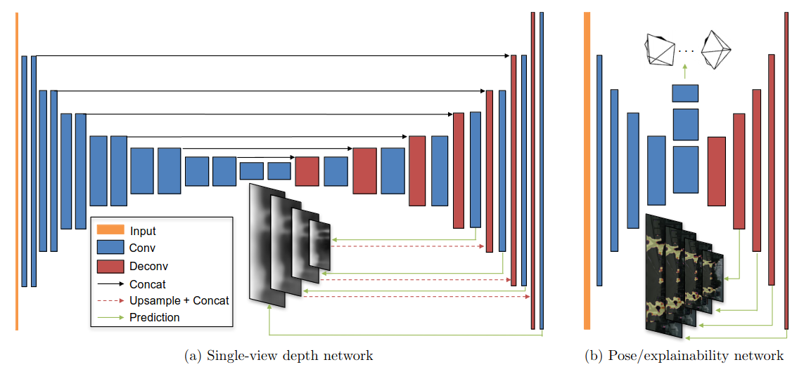

# Title: Unsupervised Learning of Depth and Ego-Motion from Video
## Author: Tinghui Zhou (2017)
## Article: [arxiv](https://arxiv.org/pdf/1704.07813.pdf)
## Task: Single-view Depth Estimation and Multi-view Pose Estimation
___

### General content
Single-view depth estimation and camera pose estimation from unlabeled video sequences.

### Keypoints
- Unsupervised learning from unlabeled video
- Joint training
- Independent inference
- Explainability network

### Approach

### Architecture

### Notes
- Given video depth network takes only target view as input and predicts depth. Pose networks additionally takes nearby views and predicts camera poses. Outputs of two networks are used to get projections on nearby views.
- Depath and pose networks share first few convolutional layer.
- To improve robustness of training pipeline explainability prediction network has been trained. It indicates network's belief in where direct synthesis will be successfully modeled for each target pixel. 
- Per-pixel loss is weighted by explainability network prediction. Regularization is added not to fall to trivial solution of predicting zero.

### Model limitations
- The scene is static, no moving objects.
- No occlusion/disocclusion between target and source views.
- The surface is Lambertian so that the photo-consistency error is meaningful.

### Results
- Monocular depth performs comparably with supervised methods that use either ground-truth pose or depth for training
- Pose estimation performs favorably compared to established SLAM systems under comparable input settings.
