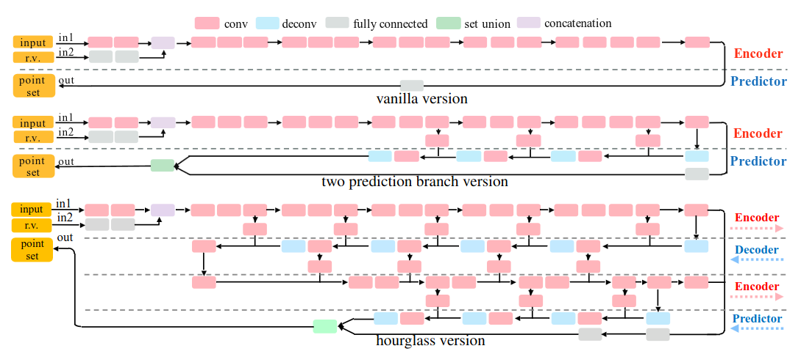
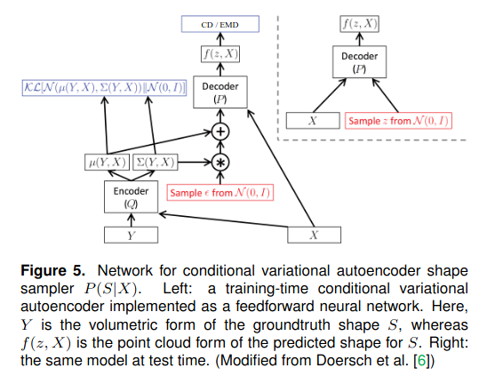

# Title: A Point Set Generation Network for 3D Object Reconstruction from a Single Image
## Author: Haoqiang Fan
## Article: [arxiv](https://arxiv.org/pdf/1612.00603.pdf)
## Task: Single image to 3D (point cloud)
___

### General content
Conditional shape sampler, capable of predicting multiple plausible 3D point clouds from an input image. Also shows great performance for 3D shape completion.

### Keypoints
* Fixed number of generated points (N = 1024)
* Generation depends on random variable to perturb the system to generate different point sets (as in GANs).
* Earth Mover's and Chamfer distances
* VAE

### PointOutNet architecture

### Notes
* Vanilla version encodes input image with added random variable and predicts point set using fully connected network generating Nx3 matrix representing N points.
* Improving the design of predictor the second version has two branches: one as previously predicts N points, while second predicts 3 channel image of size HxWx3 matrix giving another HxW points (channels are coordinates).
* To pursue even better performance, authors introduce the hourglass version, which makes encoding-decoding operations recurrently increasing representational power.

### Results
* Generation of orderless set of entities.
* Capture of ambiguity of the ground truth in aregression problem.