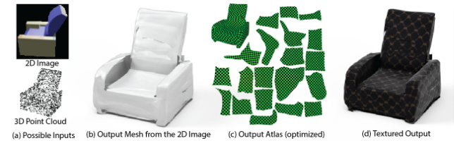
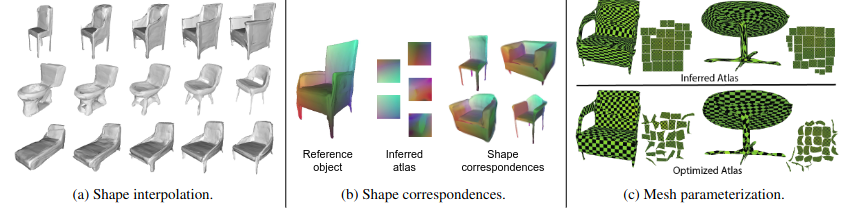

# Title: AtlasNet: A Papier-Mâché Approach to Learning 3D Surface Generation
## Author: Thibault Groueix (2018)
## Article: [arxiv](https://arxiv.org/pdf/1802.05384.pdf)
## Task: Single image to 3D (parametric)
___
### General content
Represent a 3D shape as a collection of parametric surface elements and, in contrast to methods generating voxel grids or point clouds, naturally infers a surface representation of the shape. Can be used for autoencoding shapes and single-view reconstruction.

### Keypoints
* AtlasNet is a union of learnable parametrizations. These learnable parametrizations transform a set of 2D squares to the surface.
* Continuous representation. Can be sampled at any resolution.
* MLP with ReLU activation for parametrization
* Champfer loss

### Atlas

### Applications

### Notes
* AtlasNet decodes a 3D surface from an encoding of 3D shape. Encoding can come from many different representations (point cloud, single image etc.).
* For autoencoding 3D shape PointNet based encoder was used, for image ResNet18. A latent vector (encoding) is 1024 length. Decoder is 4 fully-connected layers. For point
* Shape interpolation works on latent vectors.
* Shape correspondence: color the surface according to its 3D position. Transfered the surface colors to infered atlas. Transfered the atlas colors to other shapes such that points with the same color are parametrized by the same point in the atlas. Got semantically meaningful correspondences (chair back, legs, seat colors).
* Mesh parametrization: a good parametrization should minimize amount of area distortion and stretch. The disk like topology of meshes allows to optimize them and get small distortion and stretch.

### Results
* A new approach to generate parametric surface elements for 3D shapes.
* Single view reconstruction.
* Shape interpolation.