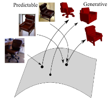
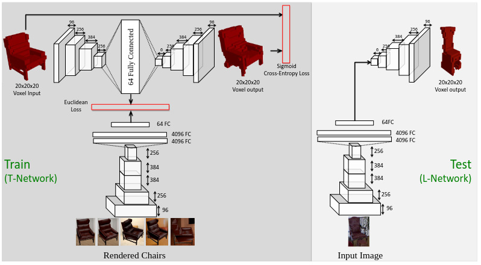

# Title: Learning a Predictable and Generative Vector Representation for Objects
## Author: Rohit Girdhar (2016)
## Article: [arxiv](https://arxiv.org/pdf/1603.08637.pdf)
## Task: Single image to 3D (voxels)
___

### General content
Learning embeddings from 2D images to generate 3D objects. Embeddings must be generative in 3D (should be able reconstruct objects in 3D from it) and predictable from 2D (we should be able to easily get this representation from images).

### Embedding space

### Architecture

### Keypoints
* TL-embedding network
* Autoencoder
* Interpolation
* Semantic meaning of dimensions
* Shape arithmetics

### Notes
* First train autoencoder to reconstruct 3D object, then train ConvNet to regress 64D embedding. Finally, finetune the network jointly.
* Interpolation between different objects works.
* Some of dimensions have a consistent effect on the reconstruction: thickness of legs or absence of legs.
* Shape arithmetics works: adding and removing a similar looking chair with straight
and curved edges respectively leads to a table with curved edges.

### Results
* Predictable and generative embeddings can be used for voxel predicion from 2D images and 3D model retrieval.
