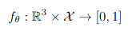

# Title: Occupancy Networks: Learning 3D Reconstruction in Function Space
## Author: Lars Mescheder (2019)
## Article: [arxiv](https://arxiv.org/pdf/1812.03828.pdf)
## Task: Single image to 3D (implicit)
___
### General content
Train occupancy network (ONet) that for every possible 3D point returns the probability of being inside the object (equivalent to binary classification). ONet can also be used for various tasks.

### Keypoints
* Train on single object, batch of K samples, cross entropy loss
* MISE algorithm
* Single image 3D reconstruction
* Point cloud completion
* Voxel super-resolution
* Unconditional mesh generation

### Occupancy function

### Notes
* Training is based on sampling points from object and learning function from 3D point to occupancy.
* For singe image 3D reconstruction task, authors use a ResNet-18 image encoder, which was pretrained on the ImageNet datase. The last layer projects the hidden representation to a 3072 dimensional vector i.e. 1024 3D points. Then train ONet on these points and get implicit representation of 3D object.
* For point cloud completetion just sample points from point cloud, and obtained occupancy function can be used to sample more points to point cloud.
* Same idea for voxel super-resolution.

### Results
* Introduced new representation, that is not constained by discertization of 3D space. 
* Experiments has shown that representation is expressive and can be efficiently used for variety of tasks.
