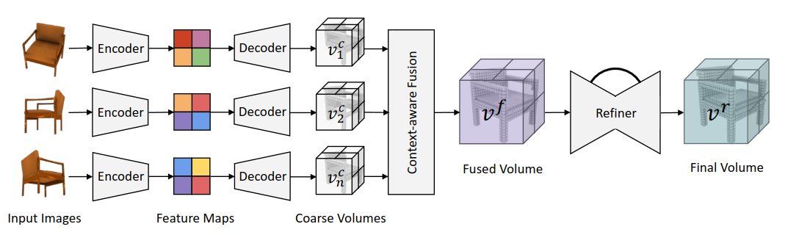
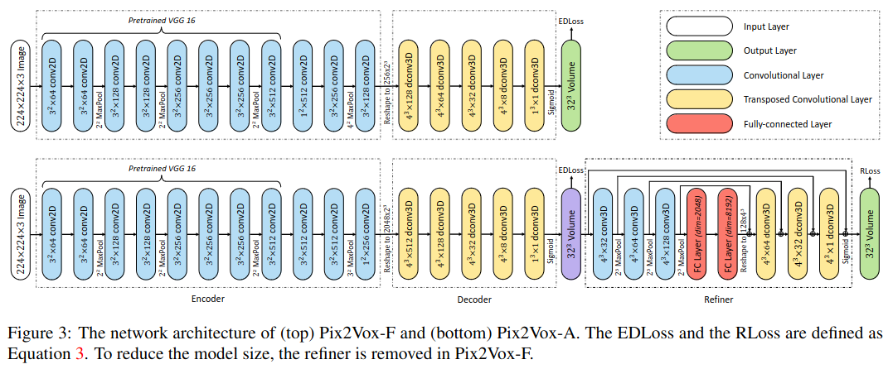
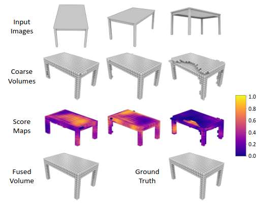
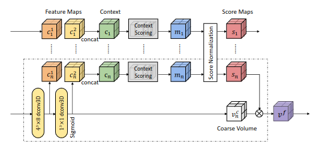

# Title: Pix2Vox: Context-aware 3D Reconstruction from Single and Multi-view Image
## Author: Haozhe Xie
## Article: [arxiv](https://arxiv.org/pdf/1901.11153.pdf)
## Task: Single image to 3D (voxels), Multi-view images to 3D
___
### General content
Encode each image and decode it to obtain coarse volumes of 3D shape. The idea is that from different viewpoints, different parts are visible, so context-aware fusion module adaptevily selects high-quality reconstruction for each part from different coarse 3D volumes. 

### Keypoints
* VGG encoder
* 3D decoder
* Attention like context-aware fusion module
* U-net like refiner

### Basic blocks

### Architecture

### Score maps

### Context aware fusion module

### Notes
* Encoder is VGG16 with additional convolutions.
* Decoder consists of 3D transposed convolutions, coarse 3D shape obtained from it.
* Such coarse shapes are passes through context-aware fusion module, where context scoring network generates a score for the context of voxel. For the images where certain part is more visible, the score will be greater. 
* Refiner is a residual network, which aims to correct wrongly recovered parts of 3D. Idea of a 3D encoder-decoder with U-net connections.
* Generalizes even to unseen objects

### Results
* Unified framework for both single and multi-view 3D reconstruction.
* Outperforms SOTA by large margin
* Much faster than existing solutions at inference time.
