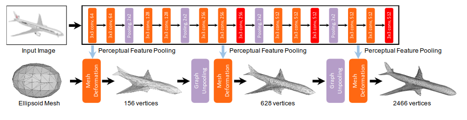
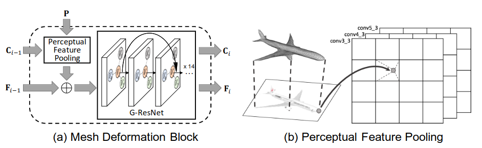
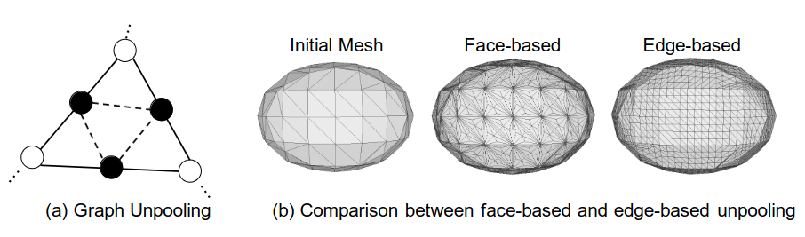

# Title: Pixel2Mesh: Generating 3D Mesh Models from Single RGB Images
## Author: Nanyang Wang
## Article: [arxiv](https://arxiv.org/pdf/1804.01654.pdf)
## Task: Single image to 3D (mesh)
___
### General content
Starting from fixed mesh of ellipsoid apply consistent mesh deformation and graph upsampling blocks we obtain mesh representation of 3D shape. 

### Cascaded mesh deformation network

### Mesh deformaion and perceptual feature pooling

### Graph unpooling

### Keypoints
* Initial ellipsoid 0.2m x 0.2 x 0.4 m, with 156 vertices
* VGG16 embeddings concatenated with point features
* G-ResNet for mesh deformation
* Graph unpooling to deform more points in the following mesh deformation block
* Chamfer and Normal loss + Laplacian and Edge-length regularizations

### Notes
* Model does not require any prior knowledge of the 3D shape.
* The vertex location - $C_i$. Pool feature from the input image - $P$. Point features from 3D mesh - $F$, 128-dim (3-dim for first deformation block, since no learnt shape feature). Using intrinsic camera intrinsics project mesh on the input image plane and pool the feature from four nearby points using bilinear interpolation.  In particular, feature are extracted from layer ‘conv3 3’, ‘conv4 3’, and ‘conv5 3’, which results in a total dimension of 1280. Then they are concatenated with the 128-dim 3D feature, resulting total dimension of 1408.
* G-ResNet represent a very deep network (14 blocks) of graph convolutional layers with 128 channels with shortcut connections. In addition, extra graph convolution applied to the last feature layer to obtain new vertex locations.
* Graph unpooling: Face-based method tells to sample new points in the centers of triangles and connect new point to vertices of triangles, which lead to imbalanced vertex degress; Edge-based methos tells to add new vertex at the middle of the edges, new 3D features are the averages of its 2 neighbors, then connect with the newly added vertices in the same triangle. 
* Laplacian regularization prevents the 3D mesh model deform too much, so that only fine-grained details are added.
* Edge-length regularization penalized flying vertices, which usually cause long edges.

### Results
* New approach to extract 3D triangular meshes from single image, exploiting the key advantage of mesh representation.
* Significantly better SOTA algorithms using other 3D shape representations (volume and point cloud).